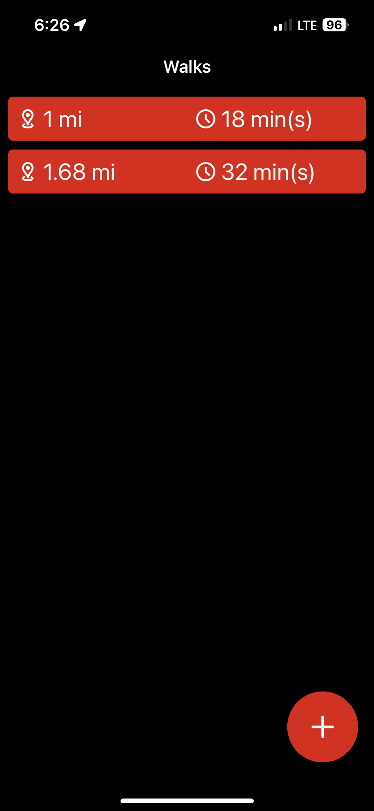
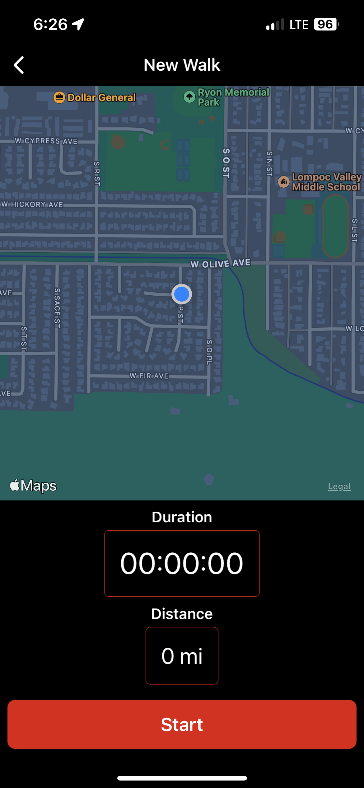
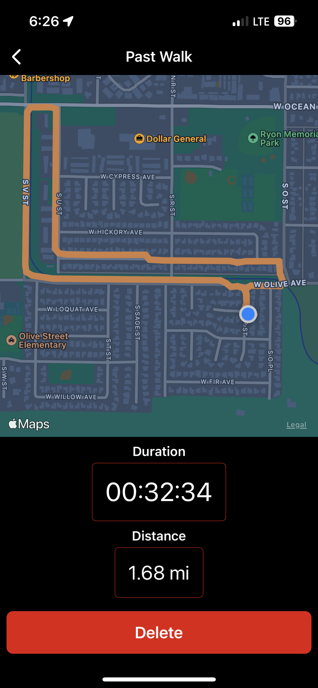

# Pet Walker App

A simple .NET MAUI app that leverages the CommunityToolkit and C# Markup libraries to create a way for user to track their daily walks. 

App uses simple MVVM structure, and all UI is made using C#/C# markup extension methods. 

## Screenshots

